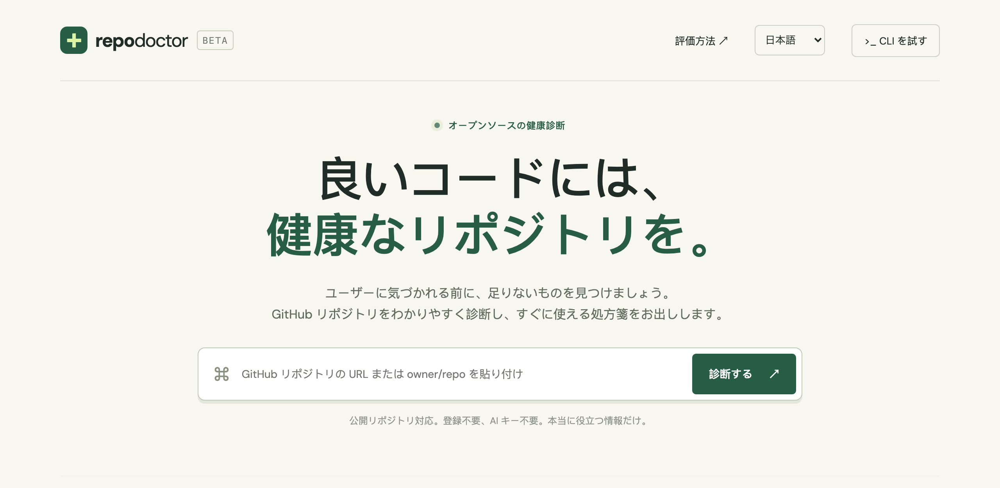
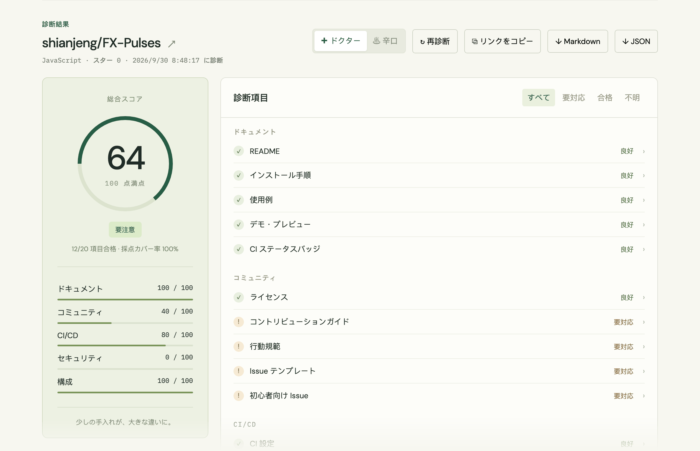
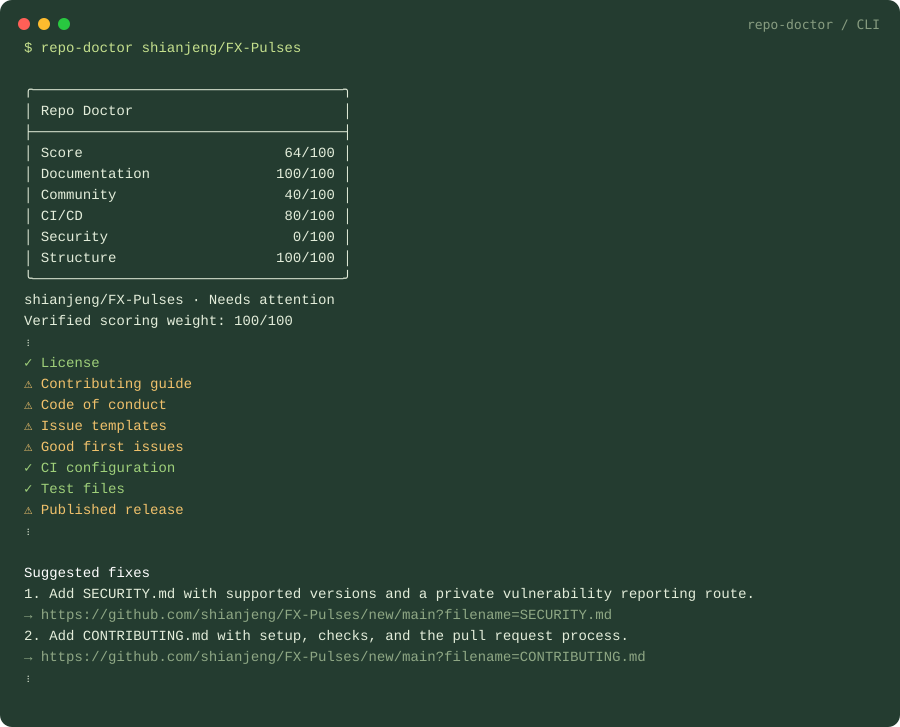

# 🩺 Repo Doctor

[English](README.md) · [简体中文](README.zh-CN.md) · **日本語**

[](https://github.com/shianjeng/repo-doctor/actions/workflows/ci.yml)
[](https://github.com/shianjeng/repo-doctor/actions/workflows/codeql.yml)
[](LICENSE)

**ユーザーに気づかれる前に、GitHub リポジトリに足りないものを見つけましょう。**

リポジトリの URL を貼るだけで、30 秒でオープンソースの健康診断ができます。

**[ライブデモを試す →](https://repo-doctor.hank-vermilion.workers.dev/?lang=ja)**

[](https://repo-doctor.hank-vermilion.workers.dev/?lang=ja)

根拠の見える 20 項目のチェックと 5 つの指標で診断し、ワンクリックで直せる処方箋をお出しします。辛口モードもあります。**AI キー不要、ランタイム依存ゼロ。**

- **ワンクリック修正**：各項目から、修正用の GitHub ページに直接移動できます。SECURITY.md、CONTRIBUTING.md、CI ワークフロー、dependabot.yml などはテンプレートが入力済みで、確認してから保存できます。
- **共有できるレポート**：`?repo=owner/repo` のリンクを開くと最新の診断が表示されます。Markdown や JSON でも出力できます。
- **README バッジ**：README にスコアを表示し、クリックすると最新の診断結果が開きます。
- **対応の管理**：処方箋をワンクリックでチェックリスト付きの GitHub Issue にできます。修正後に **再診断** すると、スコアの変化と新たに合格した項目が表示されます。
- **GitHub Action**：ワークフローを実行するたびに診断し、レポートをジョブのサマリーに表示します。
- **English・简体中文・日本語**：ブラウザの言語に合わせて表示し、いつでも切り替えられます。
- **CI モード**：スコアが基準を下回るとパイプラインを失敗させます。



## クイックスタート / インストール

**Node.js 22 以上**が必要です。プロジェクトのディレクトリで実行します：

```bash
node bin/repo-doctor.js shianjeng/FX-Pulses
node bin/repo-doctor.js fastapi/fastapi --roast
node bin/repo-doctor.js https://github.com/vercel/next.js --json
```

短いコマンドを使うには：

```bash
npm link
repo-doctor shianjeng/FX-Pulses
```

このパッケージは**まだ npm に公開していません**。上のコマンドはダウンロードしたソースを実行します。同じ名前の別の npm パッケージと混同しないでください。予定しているパッケージ名は `@shianjeng/repo-doctor` で、公開前に名前が使えるか確認が必要です。

## 実際の例

`shianjeng/FX-Pulses` の実際の診断結果（**2026-09-29 UTC**、v0.4.0 のルール）：



主な提案：セキュリティポリシー、コントリビューションガイド、依存関係の更新設定、セキュリティスキャンの追加と、リリースの公開。これは実際に記録した結果で、ハードコードされたものではありません。セキュリティの項目は見える範囲の整備状況を測るもので、0 点でもリポジトリが安全でないとは**限りません**。

機械可読なスナップショットは [examples/FX-Pulses.json](examples/FX-Pulses.json) にあります。CLI とウェブサイトは毎回最新の GitHub データを取得します。

## 使い方

```bash
repo-doctor owner/repo --json > health.json
repo-doctor owner/repo --markdown > health.md
repo-doctor owner/repo --roast
repo-doctor owner/repo --badge      # README 用バッジの Markdown
repo-doctor owner/repo --issue      # 修正項目を GitHub Issue にするリンク
repo-doctor owner/repo --min-score 80
repo-doctor owner/repo --no-color   # 色なしで出力（NO_COLOR=1 でも可）
repo-doctor --help
```

入力は `owner/repo`、`https://github.com/owner/repo`、リポジトリ内の任意のページ（`…/tree/main`、`…?tab=readme-ov-file` など）、`github.com/owner/repo`、`git@github.com:owner/repo.git` のいずれにも対応しています。

ターミナルのレポートでは、各修正項目の下に GitHub のリンクを表示します。

環境変数 `GITHUB_TOKEN` を設定すると、CLI は認証付きでリクエストし（1 時間 60 回ではなく 5,000 回）、非公開リポジトリも診断できます。シェルの環境変数や CI のシークレットで設定し、リポジトリにはコミットしないでください。非公開リポジトリでは一部のコミュニティ情報を取得できず、「不明」と表示されることがあります。

終了コード：**0** 完了または基準を満たした、**1** 基準のスコアを下回った、**2** 入力エラー・API エラー、または基準を指定したときにデータが不完全だった。JSON 出力は機械可読のままで、エラーは stderr に出力します。

### GitHub Action

どのワークフローでも診断を実行できます。レポートは実行結果の**ジョブサマリー**に表示され、`min-score` を指定するとスコアがそれを下回ったときにステップが失敗します。

```yaml
name: Repo health
on:
  push:
    branches: [main]
  schedule:
    - cron: '0 3 * * 1'   # 毎週月曜日
permissions:
  contents: read
  issues: read
jobs:
  checkup:
    runs-on: ubuntu-latest
    steps:
      - uses: shianjeng/repo-doctor@v0.4.0
        with:
          min-score: 80   # 任意
```

| 入力 | デフォルト | 説明 |
| --- | --- | --- |
| `repository` | 実行中のリポジトリ | トークンで読める任意の `owner/repo`。 |
| `min-score` | 空（レポートのみ） | スコアがこれを下回ったとき、または確認できない項目があったときに失敗します。 |
| `token` | `github.token` | GitHub API へのリクエストに使うトークン。 |

出力は `score`、`health`、`coverage`、`suggestions`（修正の提案の数）で、`${{ steps.<id>.outputs.score }}` のように使えます。依存関係はなく、ランナーに同梱の Node.js で動くため、ジョブの Node のバージョンは変わりません。このリポジトリでも [repo-health.yml](.github/workflows/repo-health.yml) で自分自身を診断しています。

### ウェブサイト

```bash
npm start
```

`http://127.0.0.1:4173` を開きます。公開リポジトリに対応し、スコアの内訳、根拠の表示、ワンクリック修正、ドクター / 辛口モード、`?repo=` 共有リンク、README バッジ、GitHub Issue 出力、Markdown / JSON 出力、英中日の 3 言語、最近 5 件の履歴（ブラウザ内にのみ保存）を備えています。修正後に **再診断** を押すと最新の結果を取得し、スコアの変化と、新たに合格・要対応になった項目を表示します。

**GitHub への問い合わせ方法。** ページはまずサイト自身のサーバー（`/api/check`）に問い合わせます。サーバーはサイトの `GITHUB_TOKEN`（全訪問者で共有、1 時間 5,000 回）で診断し、同じリポジトリの結果を 10 分間キャッシュします。サーバーにトークンがない場合は、訪問者のブラウザから GitHub に直接問い合わせます。この場合、GitHub の上限は IP アドレスごとに 1 時間 60 回（約 10 回の診断）です。トークンが非公開リポジトリを読めても、サーバーは公開リポジトリしか診断しません。

`npm start` は同じサーバーコードを実行します。`GITHUB_TOKEN=… npm start` で起動すると、ローカルでサーバー診断を試せます。

### デプロイ

ライブデモは Cloudflare Workers で動いており、設定は `wrangler.jsonc` にあります。`dist/` のファイルは静的アセットとして配信され、`worker/index.js` は `/api/check` だけを処理します。

```bash
npx wrangler deploy
```

このリポジトリを Workers Builds に接続している場合は、**Deploy command** を `npx wrangler deploy` にしてください。`main` にプッシュするたびに自動で再デプロイされます。

サーバー診断を有効にするには（おすすめ：訪問者ごとの上限がなくなります）：

1. [Fine-grained personal access token](https://github.com/settings/personal-access-tokens/new) を作成し、**Repository access** で **Public repositories** を選びます。追加の権限は不要で、公開データしか読めません。
2. Cloudflare で Worker を開き、**Settings → Variables and Secrets → Add** で種類を **Secret**、名前を `GITHUB_TOKEN` にしてトークンを貼り付け、デプロイします。`npx wrangler secret put GITHUB_TOKEN` でも設定できます。

`dist/_headers` は厳格な Content-Security-Policy（スクリプトは自サイトのみ、通信は自サイトと `api.github.com` のみ）などのセキュリティヘッダーを設定します。`npm start` でもローカルで同じヘッダーが付きます。

## 採点

| カテゴリ | 配点 | 項目 |
| --- | ---: | --- |
| ドキュメント | 25 | README 10、インストール手順 5、使用例 5、デモ 3、CI バッジ 2 |
| コミュニティ | 20 | ライセンス 8、コントリビューションガイド 5、行動規範 2、Issue テンプレート 3、初心者向け Issue 2 |
| CI/CD | 20 | CI 設定 10、テストファイル 6、公開済みリリース 4 |
| セキュリティ | 20 | セキュリティポリシー 10、依存関係の更新 5、セキュリティスキャンの設定 5 |
| 構成 | 15 | プロジェクトマニフェスト 6、ロックファイル 4、ディレクトリ構成 3、フォーマット設定 2 |

`スコア = round(合格した配点 / 確認できた配点 × 100)`

取得できなかったデータは分母から除外し、採点カバー率を常に表示します。カバー率が 100% 未満のレポートは **部分的な診断** と表示され、CI の基準を満たせません。GitHub がファイルツリーを省略した場合、見えなかったファイルを欠落とはみなしません。ロックファイルが必要なエコシステムが見つからない場合、ロックファイルの項目は合格になります。修正の順番は配点順で、セキュリティ上の深刻度を示すものではありません。

### 制限と解釈

- これは**経験則に基づくリポジトリ整備状況のチェック**であり、セキュリティ監査、法的レビュー、テスト実行、コード品質の評価ではありません。
- CI の検出は、認識できる自動化ファイルがあることを示すだけで、テストジョブ、実行結果、ブランチ保護は確認しません。
- セキュリティスキャンはファイル名で判定します。GitHub のデフォルト設定、組織レベルのスキャナー、継承されたポリシー、独自の命名、未対応のエコシステムは手動で確認が必要な場合があります。
- デモ画像はスクリーンショットでもロゴでも構いません。画像の内容は解析しません。README の判定では他の言語や形式を見落とすことがあります。
- GitHub が SPDX ライセンスを判定できなくても、ライセンスファイルがあれば合格になることがあります。実際のライセンス条項は別途確認してください。
- 最新リリースは、公開済みの正式リリース（下書き・プレリリース以外）を指します。タグだけでは合格しません。
- GitHub はすべての新しいリポジトリに `good first issue` ラベルを自動で作成するため、実際に Issue（オープン・クローズ問わず）で使われている場合のみ合格です。
- リポジトリのウェブサイト（About → Website）はライブデモとして扱います。
- オーナーの公開 `.github` リポジトリにある SECURITY.md、CONTRIBUTING.md、CODE_OF_CONDUCT.md、Issue テンプレートも合格として扱います。独自のファイルがないリポジトリには GitHub がそれを適用するためです。確認のためのリクエストは、ファイルが見つからないときだけ 1 回追加されます。
- 使い方・例・機能・ガイド・ドキュメントの見出し、2 つ以上のコード例、またはドキュメントへのリンクがあれば「使用例」は合格です。
- 1 回の診断で GitHub API を 6 回呼び出します（コミュニティ関連のファイルがない場合は 7 回）。API エラーはそのまま報告し、データを作り出すことはありません。
- 診断はデフォルトブランチを読み取ります。診断中にリポジトリが変わることもあり、特定のコミットの厳密なスナップショットではありません。

## 開発

```bash
npm test
npm run check
npm pack --dry-run
```

```text
bin/repo-doctor.js       CLI、出力形式、終了コード
dist/lib/doctor.js       GitHub への問い合わせ、採点ルール、修正リンク、出力（Web と CLI で共通）
dist/lib/templates.js    ワンクリック修正用のテンプレート
action.yml、action/      GitHub Action（ランナーの Node.js で動作、依存関係なし）
dist/index.html          ウェブ画面
dist/app.js              画面の状態、サーバー / ブラウザでの診断、レポート表示
dist/i18n.js             英語・中国語・日本語の画面テキスト
dist/style.css           レスポンシブなデザイン
dist/_headers            Cloudflare 用のセキュリティヘッダー
worker/index.js          Cloudflare Workers 上の /api/check（トークン、キャッシュ、公開リポジトリのみ）
scripts/serve.js         ローカルサーバー（同じヘッダーと /api/check）
wrangler.jsonc           Cloudflare Workers のデプロイ設定
docs/images/             README のスクリーンショット
test/doctor.test.js      オフラインのテスト（ネットワーク不要）
.github/workflows/       Node CI と CodeQL
```

言語を追加するには、`dist/i18n.js` の `UI` と `REPORT` に翻訳を追加し、`LANGUAGES` に登録します。翻訳漏れがあるとテストが失敗します。

[CONTRIBUTING.md](CONTRIBUTING.md)、[CODE_OF_CONDUCT.md](CODE_OF_CONDUCT.md)、[SECURITY.md](SECURITY.md)、[CHANGELOG.md](CHANGELOG.md) もご覧ください。ライセンスは [MIT](LICENSE) です。
