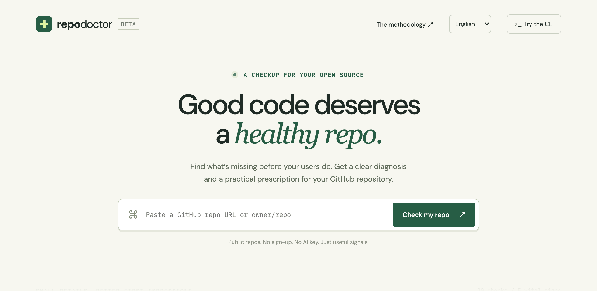
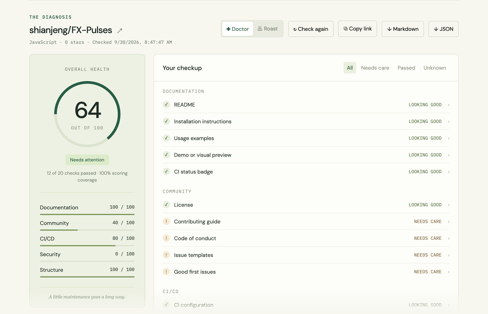
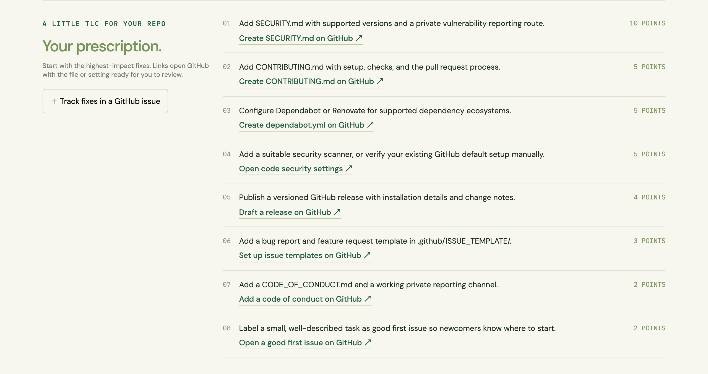

# 🩺 Repo Doctor

**English** · [简体中文](README.zh-CN.md) · [日本語](README.ja.md)

[](https://github.com/shianjeng/repo-doctor/actions/workflows/ci.yml)
[](https://github.com/shianjeng/repo-doctor/actions/workflows/codeql.yml)
[](LICENSE)

**Find what’s missing from your GitHub repository before your users do.**

Paste a GitHub repository URL. Get a 30-second open-source health check.

**[Try the live demo →](https://repo-doctor.hank-vermilion.workers.dev)**

[](https://repo-doctor.hank-vermilion.workers.dev)

Twenty transparent checks. Five vital signs. A practical prescription with one-click fixes. An optional, gentle roast. **No AI key. No runtime dependencies.**

- **One-click fixes** — each finding links to the exact GitHub page that fixes it, with starter files (SECURITY.md, CONTRIBUTING.md, CI workflow, dependabot.yml, …) prefilled for review.
- **Shareable reports** — `?repo=owner/repo` links open a fresh check; export Markdown or JSON.
- **README badge** — show your score, linked back to a live check.
- **Track fixes** — turn the prescription into a GitHub issue task list in one click, then **check again** to see the score change and what now passes.
- **GitHub Action** — a checkup in every workflow run, with the report in the job summary.
- **English, 简体中文, 日本語** — the website follows your browser language; switch any time.
- **CI mode** — fail a pipeline below a minimum score.





## Quick start / Installation

Requires **Node.js 22+**. From this project directory:

```bash
node bin/repo-doctor.js shianjeng/FX-Pulses
node bin/repo-doctor.js fastapi/fastapi --roast
node bin/repo-doctor.js https://github.com/vercel/next.js --json
```

To enable the short command locally:

```bash
npm link
repo-doctor shianjeng/FX-Pulses
```

The package is **not yet published to npm**. These commands run the source you downloaded; do not assume an unrelated unscoped npm package is this project. The prepared package name is `@shianjeng/repo-doctor`; registry availability and ownership must be verified before publishing.

## Real example

Live result for `shianjeng/FX-Pulses`, checked **2026-09-29 UTC** with v0.4.0 rules:


Top suggestions: add a security policy, contribution guide, dependency update configuration, security automation, and a published release. This is a recorded check, not a hard-coded application result. The security category measures visible hygiene signals; a zero does **not** establish that a repository is insecure.

The machine-readable snapshot is in [examples/FX-Pulses.json](examples/FX-Pulses.json). The CLI and website always request current GitHub data.

## Usage

```bash
repo-doctor owner/repo --json > health.json
repo-doctor owner/repo --markdown > health.md
repo-doctor owner/repo --roast
repo-doctor owner/repo --badge      # Markdown badge for your README
repo-doctor owner/repo --issue      # link that opens the fixes as a GitHub issue
repo-doctor owner/repo --min-score 80
repo-doctor owner/repo --no-color   # plain output (NO_COLOR=1 works too)
repo-doctor --help
```

Any of these inputs work: `owner/repo`, `https://github.com/owner/repo`, a page inside the repository such as `…/tree/main` or `…?tab=readme-ov-file`, `github.com/owner/repo`, or `git@github.com:owner/repo.git`.

The terminal report prints a GitHub link under each suggested fix.

Optional `GITHUB_TOKEN` enables authenticated requests (5,000 per hour instead of 60) and private repositories in the CLI. Set it through your shell environment or CI secret manager; never commit it. It needs read access to the repository data being checked. Some community metadata may be unavailable for private repositories and will be marked unknown.

Exit codes: **0** completed / threshold met; **1** below the requested threshold; **2** invalid input, API failure, or incomplete data when enforcing a threshold. JSON output stays machine-readable; errors go to stderr.

### GitHub Action

Run a checkup in any workflow. The report appears in the run’s **job summary**; with `min-score`, the step fails when the score drops below it.

```yaml
name: Repo health
on:
  push:
    branches: [main]
  schedule:
    - cron: '0 3 * * 1'   # every Monday
permissions:
  contents: read
  issues: read
jobs:
  checkup:
    runs-on: ubuntu-latest
    steps:
      - uses: shianjeng/repo-doctor@v0.4.0
        with:
          min-score: 80   # optional
```

| Input | Default | |
| --- | --- | --- |
| `repository` | the current repository | Any `owner/repo` the token can read. |
| `min-score` | empty (report only) | Fail below this score, or when some signals could not be verified. |
| `token` | `github.token` | Token used for GitHub API requests. |

Outputs: `score`, `health`, `coverage`, and `suggestions` (number of fixes), for example `${{ steps.<id>.outputs.score }}`. The action has no dependencies and runs on the runner’s bundled Node.js, so it does not change the job’s Node version. This repository runs it on itself in [repo-health.yml](.github/workflows/repo-health.yml).

### Website

```bash
npm start
```

Open `http://127.0.0.1:4173`. The website supports public repositories. It includes a score breakdown, expandable evidence, one-click fixes, Doctor/Roast modes, shareable `?repo=` links, a README badge, a GitHub issue export, Markdown/JSON export, English/Chinese/Japanese, and your five most recent checks (stored only in your browser). After a fix, **Check again** fetches fresh results and shows the score change and which checks newly pass or fail. Fonts may be loaded from Google Fonts with local fallbacks.

**How checks reach GitHub.** The page first asks the site’s own server (`/api/check`), which checks with the site’s `GITHUB_TOKEN` (5,000 requests per hour, shared) and caches each repository’s result for ten minutes. If the server has no token, the page calls GitHub directly from the visitor’s browser, where GitHub allows 60 requests per hour per IP address — about ten checks. The server only checks public repositories, even if its token could read private ones.

`npm start` runs the same server code: start it with `GITHUB_TOKEN=… npm start` to test server checks locally.

### Deploy

The live demo runs on Cloudflare Workers, configured by `wrangler.jsonc`. Files in `dist/` are served as static assets; `worker/index.js` only handles `/api/check`.

```bash
npx wrangler deploy
```

With Workers Builds connected to this repository, set the **Deploy command** to `npx wrangler deploy`; every push to `main` then redeploys.

To enable server checks (recommended — it removes the per-visitor limit):

1. Create a [fine-grained personal access token](https://github.com/settings/personal-access-tokens/new) with **Repository access → Public repositories** and no extra permissions. It can only read public data.
2. In Cloudflare, open the Worker → **Settings → Variables and Secrets → Add**, choose type **Secret**, name it `GITHUB_TOKEN`, paste the token, and deploy. Or run `npx wrangler secret put GITHUB_TOKEN`.

`dist/_headers` sets a strict Content-Security-Policy (scripts from this origin only; network access to this origin and `api.github.com` only) plus other security headers; `npm start` applies the same headers locally.

## Scoring

| Category | Weight | Signals |
| --- | ---: | --- |
| Documentation | 25 | README 10, installation 5, usage 5, demo 3, CI badge 2 |
| Community | 20 | license 8, contributing 5, conduct 2, issue templates 3, good first issues 2 |
| CI/CD | 20 | CI configuration 10, test files 6, published release 4 |
| Security | 20 | policy 10, dependency updates 5, security workflow signal 5 |
| Structure | 15 | manifest 6, lockfile 4, source/docs layout 3, formatting config 2 |

`score = round(passed weight / verified weight × 100)`

Unknown data is excluded from the denominator; scoring coverage is always shown. Reports below 100% coverage are labeled **Partial check** and cannot pass a CI threshold. A truncated GitHub tree never turns unseen paths into missing-file warnings. A lockfile is treated as satisfied if no lockfile ecosystem is detected. Fixes are ordered by weight, not by an assertion of security severity.

### Limits and interpretation

- This is a **heuristic repository hygiene check**, not a security audit, legal review, test execution, or code-quality measurement.
- CI detection means a recognizable automation file exists; it does not verify test jobs, successful runs, or branch protection.
- Security automation detection uses filenames. GitHub default setup, organization-level scanners, inherited security policies, custom names, and unsupported ecosystems may require manual review.
- A demo image can be a screenshot or logo; image contents are not interpreted. README pattern checks can miss alternative languages and formats.
- A license file can pass without GitHub identifying its SPDX license. Review actual license terms separately.
- Latest release means a published non-draft, non-prerelease GitHub release. Tags alone do not count.
- GitHub creates a `good first issue` label in every new repository, so the check passes only when at least one issue (open or closed) uses it.
- A repository website (the About → Website field) counts as a live demo.
- SECURITY.md, CONTRIBUTING.md, CODE_OF_CONDUCT.md, and issue templates in the owner’s public `.github` repository count, because GitHub applies them to repositories without their own. Checking them costs one extra request, only when a file is missing.
- Usage passes with a usage, example, features, guide, or documentation section, two or more code examples, or a link to documentation.
- One check makes six GitHub API requests (seven when community files are missing locally). API failures are reported rather than replaced with invented data.
- The scanner reads the default branch; repositories may change during collection. It is not an atomic commit snapshot.

GitHub API references: [repository contents](https://docs.github.com/en/rest/repos/contents), [Git trees](https://docs.github.com/en/rest/git/trees), [rate limits](https://docs.github.com/en/rest/using-the-rest-api/rate-limits-for-the-rest-api).

## Development

```bash
npm test
npm run check
npm pack --dry-run
```

```text
bin/repo-doctor.js       CLI, output formats, exit codes
dist/lib/doctor.js       Shared GitHub client, scoring engine, fix links, exports
dist/lib/templates.js    Starter files offered as one-click fixes
action.yml, action/      GitHub Action (runs on the runner’s Node.js, no dependencies)
dist/index.html          Web interface
dist/app.js              UI state, server/browser checks, report rendering
dist/i18n.js             English, Chinese, and Japanese interface text
dist/style.css           Responsive visual design
dist/_headers            Security headers for Cloudflare
worker/index.js          /api/check on Cloudflare Workers (token, cache, public-only)
scripts/serve.js         Local server (same headers and /api/check)
wrangler.jsonc           Cloudflare Workers deployment
docs/images/             README screenshots
test/doctor.test.js      Offline regression tests
.github/workflows/       Node CI and CodeQL
```

To add a language, add a block to `UI` and `REPORT` in `dist/i18n.js` and an entry to `LANGUAGES`; the tests fail if a string is left untranslated.

The optional WebMCP `check_repository` tool uses the same scanning action as the interface and is feature-detected. It is skipped by browsers without support.

See [CONTRIBUTING.md](CONTRIBUTING.md), [CODE_OF_CONDUCT.md](CODE_OF_CONDUCT.md), [SECURITY.md](SECURITY.md), and [CHANGELOG.md](CHANGELOG.md). Licensed under [MIT](LICENSE).

## Launch checklist

- [x] Create the GitHub repository and push this source.
- [x] Run CI and CodeQL on GitHub Actions.
- [x] Deploy the website (Cloudflare Workers).
- [x] Add screenshots to the README.
- [x] Tag `v0.2.0` and publish a GitHub release.
- [ ] Tag `v0.4.0` and publish a release so `uses: shianjeng/repo-doctor@v0.4.0` works.
- [ ] Add the `GITHUB_TOKEN` secret to the Worker for server checks.
- [ ] Enable private vulnerability reporting (Settings → Code security).
- [ ] Set the repository website and topics (About → ⚙).
- [ ] Open a first issue labeled `good first issue`.
- [ ] Review package name availability and publish to npm when ready.
