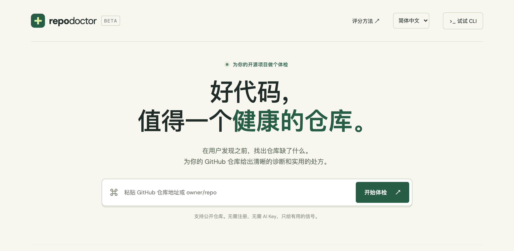
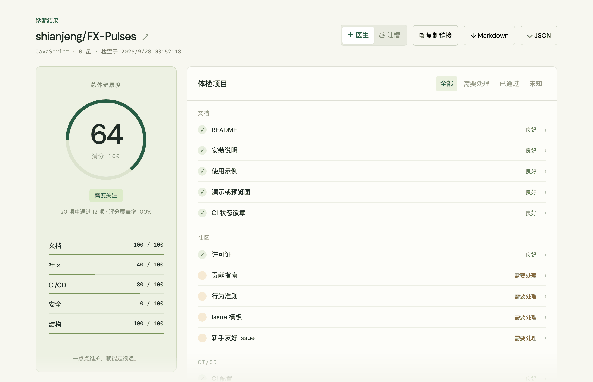

# 🩺 Repo Doctor

[English](README.md) · **简体中文** · [日本語](README.ja.md)

[](https://github.com/shianjeng/repo-doctor/actions/workflows/ci.yml)
[](https://github.com/shianjeng/repo-doctor/actions/workflows/codeql.yml)
[](LICENSE)

**在用户发现之前，找出你的 GitHub 仓库缺了什么。**

粘贴一个 GitHub 仓库地址，30 秒完成一次开源项目体检。

**[在线体验 →](https://repo-doctor.hank-vermilion.workers.dev/?lang=zh)**

[](https://repo-doctor.hank-vermilion.workers.dev/?lang=zh)

20 项透明的检查，5 项健康指标，附带一键修复的实用处方，还有可选的温和吐槽模式。**不需要 AI Key，没有运行时依赖。**

- **一键修复**：每个问题都链接到 GitHub 上对应的修复页面。SECURITY.md、CONTRIBUTING.md、CI 工作流、dependabot.yml 等会预先填好模板，由你检查后提交。
- **可分享的报告**：`?repo=owner/repo` 链接打开时会重新检查；可导出 Markdown 或 JSON。
- **README 徽章**：展示你的分数，点击徽章会重新检查。
- **跟踪修复**：一键把处方变成带勾选框的 GitHub Issue。
- **English、简体中文、日本語**：网站会跟随浏览器语言，也可以随时切换。
- **CI 模式**：分数低于设定值时让流水线失败。



## 快速开始 / 安装

需要 **Node.js 22+**。在项目目录中运行：

```bash
node bin/repo-doctor.js shianjeng/FX-Pulses
node bin/repo-doctor.js fastapi/fastapi --roast
node bin/repo-doctor.js https://github.com/vercel/next.js --json
```

在本地启用短命令：

```bash
npm link
repo-doctor shianjeng/FX-Pulses
```

本项目**尚未发布到 npm**。上面的命令运行的是你下载的源码，不要把其他同名的 npm 包当成本项目。预留的包名是 `@shianjeng/repo-doctor`，发布前需要确认该名称可用。

## 真实示例

`shianjeng/FX-Pulses` 的实际检查结果（**2026-09-27 UTC**，v0.2.0 规则）：


主要建议：添加安全策略、贡献指南、依赖更新配置、安全扫描，并发布一个 Release。这是真实记录的检查结果，不是写死的数据。安全类只衡量可见的规范信号，0 分**不代表**仓库不安全。

机器可读的快照在 [examples/FX-Pulses.json](examples/FX-Pulses.json)。CLI 和网站每次都会请求最新的 GitHub 数据。

## 用法

```bash
repo-doctor owner/repo --json > health.json
repo-doctor owner/repo --markdown > health.md
repo-doctor owner/repo --roast
repo-doctor owner/repo --badge      # 生成 README 徽章的 Markdown
repo-doctor owner/repo --issue      # 生成把修复建议变成 GitHub Issue 的链接
repo-doctor owner/repo --min-score 80
repo-doctor --help
```

支持以下输入格式：`owner/repo`、`https://github.com/owner/repo`、仓库内的任意页面（如 `…/tree/main`、`…?tab=readme-ov-file`）、`github.com/owner/repo`、`git@github.com:owner/repo.git`。

终端报告会在每条修复建议下面给出 GitHub 链接。

设置 `GITHUB_TOKEN` 环境变量后，CLI 会使用登录身份请求（每小时 5,000 次，而不是 60 次），并且可以检查私有仓库。请通过终端环境变量或 CI 的 Secret 设置，不要提交到仓库。私有仓库的部分社区信息可能无法获取，会显示为 “未知”。

退出码：**0** 完成或达到阈值；**1** 低于设定的最低分；**2** 输入错误、API 失败，或在设置阈值时数据不完整。JSON 输出保持机器可读，错误信息输出到 stderr。

### 网站

```bash
npm start
```

打开 `http://127.0.0.1:4173`。网站支持公开仓库，包括分数明细、可展开的依据、一键修复、医生 / 吐槽两种语气、`?repo=` 分享链接、README 徽章、GitHub Issue 导出、Markdown / JSON 导出、中英日三种语言，以及最近 5 次检查记录（只保存在你的浏览器中）。

**检查请求是怎么发到 GitHub 的？** 页面会先请求本站服务器（`/api/check`），服务器用本站的 `GITHUB_TOKEN` 检查（所有访客共享每小时 5,000 次），同一仓库的结果缓存 10 分钟。如果服务器没有配置 Token，页面会改为从访客的浏览器直接请求 GitHub，GitHub 对每个 IP 每小时只允许 60 次请求，大约能检查 10 次。即使服务器的 Token 能读取私有仓库，服务器也只检查公开仓库。

`npm start` 运行的是同一套服务器代码。用 `GITHUB_TOKEN=… npm start` 启动，就可以在本地测试服务器检查。

### 部署

在线版运行在 Cloudflare Workers 上，配置在 `wrangler.jsonc`。`dist/` 中的文件作为静态资源直接提供，`worker/index.js` 只处理 `/api/check`。

```bash
npx wrangler deploy
```

如果已经把本仓库连接到 Workers Builds，请把 **Deploy command** 设为 `npx wrangler deploy`，之后每次推送到 `main` 都会自动重新部署。

开启服务器检查（推荐，可以解决每位访客的请求上限问题）：

1. 创建一个 [Fine-grained personal access token](https://github.com/settings/personal-access-tokens/new)，**Repository access** 选择 **Public repositories**，不需要额外权限。这个 Token 只能读取公开数据。
2. 在 Cloudflare 中打开这个 Worker → **Settings → Variables and Secrets → Add**，类型选 **Secret**，名称填 `GITHUB_TOKEN`，粘贴 Token 后部署。也可以运行 `npx wrangler secret put GITHUB_TOKEN`。

`dist/_headers` 设置了严格的内容安全策略（只允许本站脚本，网络请求只允许本站和 `api.github.com`）以及其他安全响应头，`npm start` 在本地也会使用相同的响应头。

## 评分

| 类别 | 权重 | 检查项 |
| --- | ---: | --- |
| 文档 | 25 | README 10、安装说明 5、使用示例 5、演示 3、CI 徽章 2 |
| 社区 | 20 | 许可证 8、贡献指南 5、行为准则 2、Issue 模板 3、新手友好 Issue 2 |
| CI/CD | 20 | CI 配置 10、测试文件 6、已发布的 Release 4 |
| 安全 | 20 | 安全策略 10、依赖更新 5、安全扫描工作流 5 |
| 结构 | 15 | 项目清单文件 6、锁文件 4、目录结构 3、格式化配置 2 |

`分数 = round(通过的权重 / 已验证的权重 × 100)`

无法获取的数据不计入分母，并始终显示评分覆盖率。覆盖率低于 100% 的报告标记为 **部分检查**，无法通过 CI 阈值。GitHub 截断文件树时，看不到的文件不会被当作缺失。没有检测到需要锁文件的生态时，锁文件项视为通过。修复建议按权重排序，不代表安全严重程度。

### 局限与解读

- 这是**启发式的仓库规范检查**，不是安全审计、法律审查、测试执行或代码质量评估。
- 检测到 CI 只表示存在可识别的自动化配置文件，不验证测试任务、运行结果或分支保护。
- 安全扫描根据文件名判断。GitHub 默认设置、组织级扫描、继承的安全策略、自定义命名和不支持的生态可能需要人工确认。
- 演示图片可以是截图或 Logo，不会分析图片内容。README 内容检查可能漏掉其他语言或格式。
- 即使 GitHub 未识别出 SPDX 许可证，许可证文件也可以通过检查。请另行确认实际许可条款。
- 最新 Release 指已发布的正式版本（非草稿、非预发布），只有标签不算。
- GitHub 会在每个新仓库自动创建 `good first issue` 标签，所以至少要有一个 Issue（开启或关闭均可）使用了这个标签才算通过。
- 仓库网站（About → Website）视为在线演示。
- 每次检查发送 6 个 GitHub API 请求。API 失败时会如实报告，不会编造数据。
- 检查读取的是默认分支，检查过程中仓库可能发生变化，不是某个提交的原子快照。

## 开发

```bash
npm test
npm run check
npm pack --dry-run
```

```text
bin/repo-doctor.js       CLI、输出格式、退出码
dist/lib/doctor.js       GitHub 请求、评分规则、修复链接、导出（网页与 CLI 共用）
dist/lib/templates.js    一键修复用的模板文件
dist/index.html          网页界面
dist/app.js              界面状态、服务器 / 浏览器检查、报告渲染
dist/i18n.js             英文、中文、日文界面文本
dist/style.css           响应式样式
dist/_headers            Cloudflare 安全响应头
worker/index.js          Cloudflare Workers 上的 /api/check（Token、缓存、仅公开仓库）
scripts/serve.js         本地服务器（相同的响应头和 /api/check）
wrangler.jsonc           Cloudflare Workers 部署配置
docs/images/             README 截图
test/doctor.test.js      离线测试（不需要网络）
.github/workflows/       Node CI 和 CodeQL
```

新增语言：在 `dist/i18n.js` 的 `UI` 和 `REPORT` 中添加一组翻译，并在 `LANGUAGES` 中登记。如果有文本漏翻，测试会失败。

### 修改后如何更新网站

```bash
npm test
npm run check
git add -A
git commit -m "描述这次改了什么"
git push
```

推送到 `main` 后，Cloudflare 会自动重新部署，约一分钟后生效。

参见 [CONTRIBUTING.md](CONTRIBUTING.md)、[CODE_OF_CONDUCT.md](CODE_OF_CONDUCT.md)、[SECURITY.md](SECURITY.md) 和 [CHANGELOG.md](CHANGELOG.md)。以 [MIT](LICENSE) 许可证发布。
